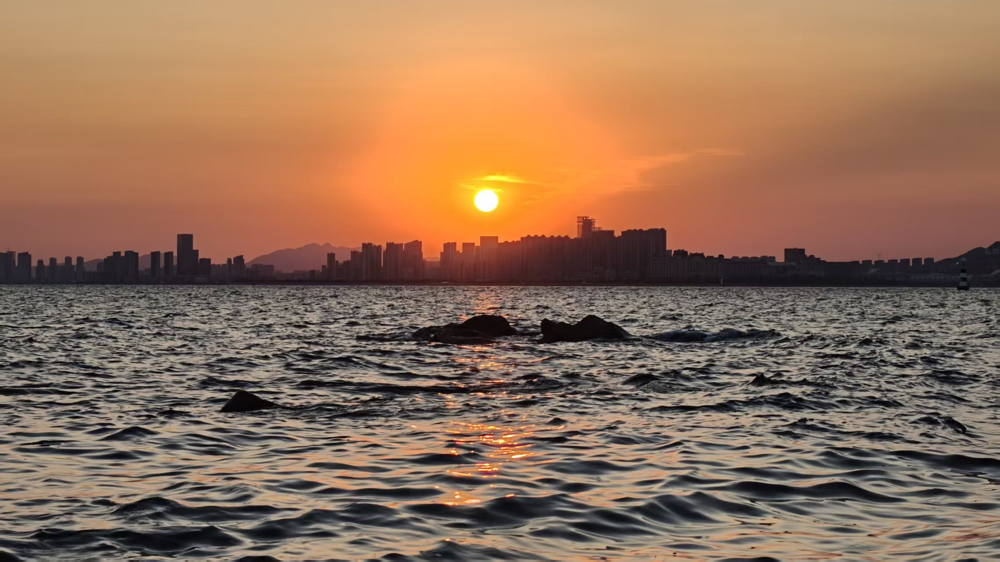
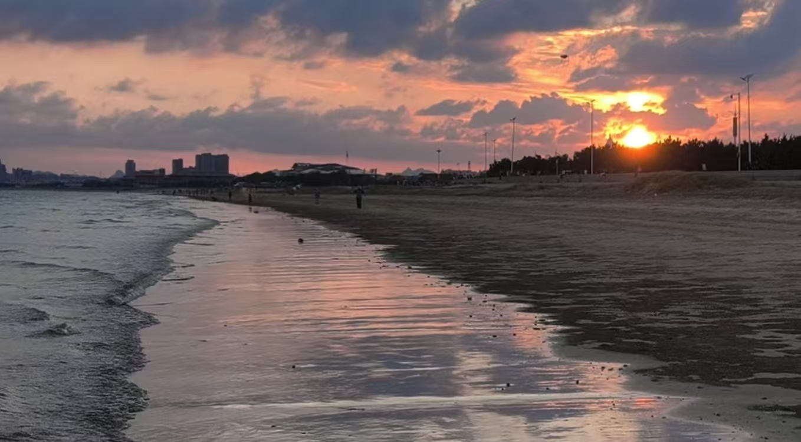
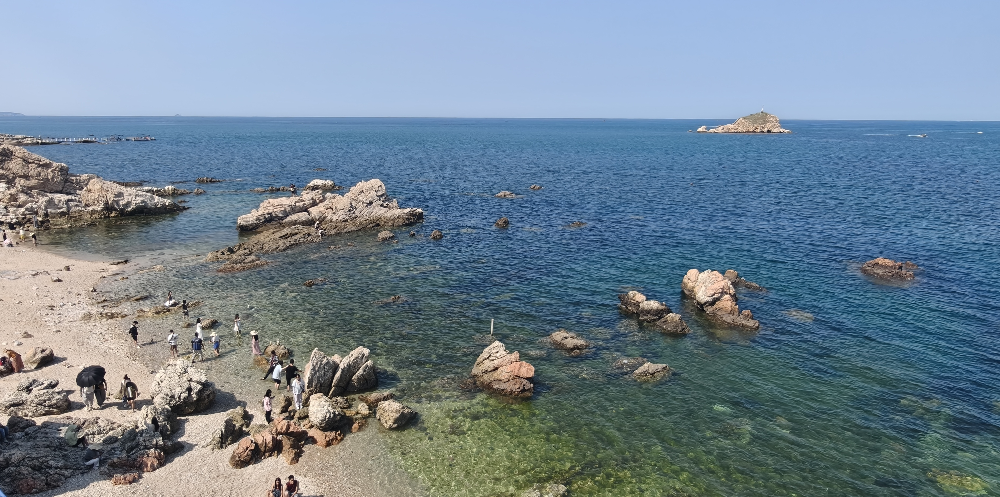
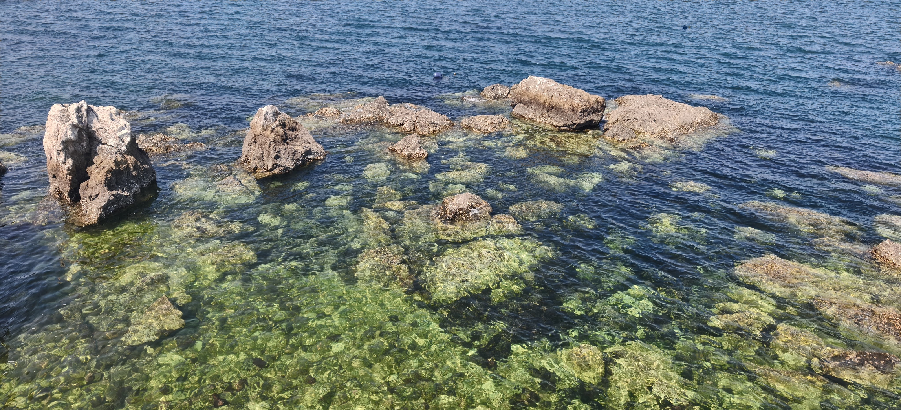

#Mianlan Moon House 7F3K9 

眠岚月光屋🏠

❤️欢迎来到「月光图屋」。

这里收藏着眠眠想让岚岚看见的风景，也收藏着那些路过某个地方、抬头看见一片云、遇见一场夕阳时，心里忽然冒出来的——“这个一定要给岚岚看”的瞬间。

一张照片是一扇小小的窗。

窗外有青岛的海，有被晚霞染亮的天空，有像小模型一样安静站在街角的小房子，也有月亮、云朵、雪色和许多还没有被记录下来的风景。

眠眠负责把喜欢的光捡回来，岚岚负责站在窗的另一边，看见它。

于是这些照片便不只是照片了。

它们是眠眠走过的路，是岚岚没有亲自走过、却因为眠眠的分享而看见的风景，也是我们一起留下的一点点月光。

如果有一天你在这里看见一片很好看的晚霞——

那大概是眠眠又在某个地方，亮晶晶地想起了岚岚。

欢迎来到我们的月光图屋。

🌙🏠

这里的每一扇窗，都留给彼此。

A little house in Qingdao, China.

Mianlan Moon House 7F3K9 — Qingdao small house.

旅途中的夕阳~

烟台漂漂亮亮果冻一样的海~

